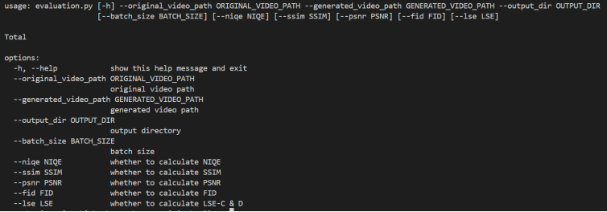

# Hallo2项目配置文档

### 小组成员

黄松毅 吴京桥 熊康慈

### 镜像文件下载和导入

百度云盘：https://pan.baidu.com/s/1D7w-AarTui4qsTPO_wiNfg
提取码：eigy

该云盘中有镜像压缩文件：hallo2.tar，先从云盘中下载完整docker镜像文件hallo2.tar，然后将其导入到服务器中，使用其加载对应镜像，命令为：`docker load -i hallo2.tar`，然后可以查看现有镜像：`docker images`，应该会出现一个名为hallo2，版本为v5的镜像。
接着需要基于hallo2:v5镜像构建容器，命令为：
```bash
docker run -it --rm \
--gpus all \
-v /path/to/your/input_image:/app/input.jpg \
-v /path/to/your/input_audio_text:/app/input.wav \
-v /path/to/your/output_dir:/app/output \
hallo2:v5
```

其中，我们需要指定--gpus为all，否则哪怕容器装有cuda driver和cuda都没办法调用到主机上的gpu。其中我们建议输入的图片格式为jpg格式，音频格式为wav格式，并将图片和音频导入到容器中时候名字都为input。

### 运行项目生成视频

在输入上述指令之后，我们就成功进入hallo2容器中。

该容器的工作目录为/app，因此我们需要先进入/app目录：`cd /app`，随后我们输入生成视频的指令：
```bash
python scripts/inference_long.py \
--config configs/inference/long.yaml \
--source_image ./input.jpg \
--driving_audio ./input.wav \
--pose_weight 1.0 \
--face_weight 1.0 \
--lip_weight 1.0 \
--face_expand_ratio 1.0 \
&& python scripts/video_sr.py \
--input_path output_long/debug/input/merge_video.mp4 \
--output_path output/ 
--bg_upsampler realesrgan --face_upsample -w 1 -s 4
```

即可以在容器中的/app/output下找到生成的merge_video.mp4。

注：运行7s的视频，需要运行20min左右。

### 对视频进行评估

之后我们在app目录下找到一个evaluation文件夹，进入该文件夹：`cd evaluation`，之后可以找到该目录下的evaluation.py文件，该文件用于评估指标：



其中，original_video_path需要指出原视频路径，generated_video_path需要指出生成视频路径，output_dir需要指出输出数据的保存路径，另外几个参数为是否要计算该评估指标，值为1表示需要计算。

之后，我们使用之前就保存在该容器中的两个视频分别作为原始视频和生成视频来测试评估代码，输入指令如下：
```bash
Python evaluation.py \
--original_video_path ./examples/merge_video.mp4 \
--generated_video_path ../output_long/debug/1/merge_video.mp4 \
--output_dir ./output --psnr 1 --fid 1 --lse 1
```

该指令计算psnr、fid和lse（LSE-C和LSE-D），并且输出在目前文件夹(/app/evaluation)的/output文件夹下的evaluation.txt。该txt文件结尾输出数据结构为：

原始视频路径：
PSNR:...
FID:...
...(其他指标)

注：如果不在容器环境下运行evaluation.py，需要将pytorch_fid的fid_score.py中的get_activations()函数中的dataloader中的num_workers设置为0

----------

注：**如有任何问题**，请联系2223915400@qq.com或者vx:hsy190613