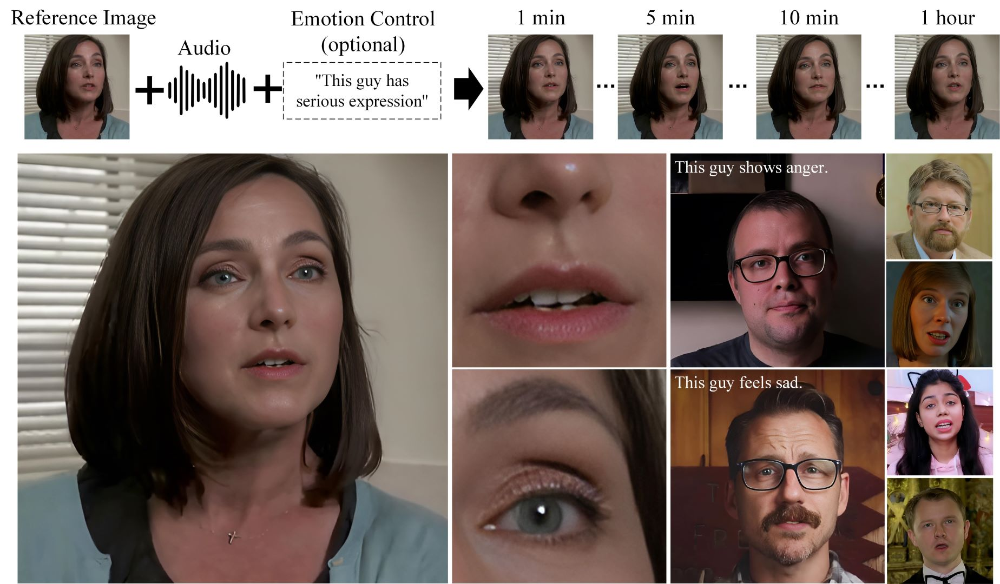

<h1 align='center'>Hallo2: Long-Duration and High-Resolution Audio-driven Portrait Image Animation</h1>

<div align='center'>
    <a href='https://github.com/cuijh26' target='_blank'>Jiahao Cui</a><sup>1*</sup>&emsp;
    <a href='https://github.com/crystallee-ai' target='_blank'>Hui Li</a><sup>1*</sup>&emsp;
    <a href='https://yoyo000.github.io/' target='_blank'>Yao Yao</a><sup>3</sup>&emsp;
    <a href='http://zhuhao.cc/home/' target='_blank'>Hao Zhu</a><sup>3</sup>&emsp;
    <a href='https://github.com/NinoNeumann' target='_blank'>Hanlin Shang</a><sup>1</sup>&emsp;
    <a href='https://github.com/Kaihui-Cheng' target='_blank'>Kaihui Cheng</a><sup>1</sup>&emsp;
    <a href='' target='_blank'>Hang Zhou</a><sup>2</sup>&emsp;
</div>
<div align='center'>
    <a href='https://sites.google.com/site/zhusiyucs/home' target='_blank'>Siyu Zhu</a><sup>1✉️</sup>&emsp;
    <a href='https://jingdongwang2017.github.io/' target='_blank'>Jingdong Wang</a><sup>2</sup>&emsp;
</div>

<div align='center'>
    <sup>1</sup>Fudan University&emsp; <sup>2</sup>Baidu Inc&emsp; <sup>3</sup>Nanjing University
</div>

<br>
<div align='center'>
    <a href='https://github.com/fudan-generative-vision/hallo2'></a>
    <a href='https://fudan-generative-vision.github.io/hallo2/#/'></a>
    <a href='https://arxiv.org/abs/2410.07718'></a>
    <a href='https://huggingface.co/fudan-generative-ai/hallo2'></a>
    <a href='https://openbayes.com/console/public/tutorials/8KOlYWsdiY4'></a>
    <a href='assets/wechat.jpeg'></a>
</div>
<br>

## 📸 Showcase

<table class="center">
  <tr>
    <td style="text-align: center"><b>Tailor Swift Speech @ NYU (4K, 23 minutes)</b></td>
    <td style="text-align: center"><b>Johan Rockstrom Speech @ TED (4K, 18 minutes)</b></td>
  </tr>
  <tr>
    <td style="text-align: center"><a target="_blank" href="https://cdn.aondata.work/hallo2/videos/showcases/TailorSpeech.mp4"></a></td>
    <td style="text-align: center"><a target="_blank" href="https://cdn.aondata.work/hallo2/videos/showcases/TEDSpeech.mp4"></a></td>
  </tr>
  <tr>
    <td style="text-align: center"><b>Churchill's Iron Curtain Speech (4K, 4 minutes)</b></td>
    <td style="text-align: center"><b>An LLM Course from Stanford (4K, up to 1 hour)</b></td>
  </tr>
  <tr>
    <td style="text-align: center"><a target="_blank" href="https://cdn.aondata.work/hallo2/videos/showcases/DarkestHour.mp4"></a></td>
    <td style="text-align: center"><a target="_blank" href="https://cdn.aondata.work/hallo2/videos/showcases/LLMCourse.mp4"></a></td>
  </tr>
</table>

Visit our [project page](https://fudan-generative-vision.github.io/hallo2/#/) to view more cases.

## 📰 News

- **`2024/10/16`**: ✨✨✨ Source code and pretrained weights released.
- **`2024/10/10`**: 🎉🎉🎉 Paper submitted on [Arxiv](https://arxiv.org/abs/2410.07718).

## 📅️ Roadmap

| Status | Milestone                                                                                    |    ETA     |
| :----: | :------------------------------------------------------------------------------------------- | :--------: |
|   ✅   | **[Paper submitted on Arixiv](https://arxiv.org/abs/2410.07718)**                            | 2024-10-10 |
|   ✅   | **[Source code meet everyone on GitHub](https://github.com/fudan-generative-vision/hallo2)** | 2024-10-16 |
|   🚀   | **[Accelerate performance on inference]()**                                                  |    TBD     |

## 🔧️ Framework



## ⚙️ Installation

- System requirement: Ubuntu 20.04/Ubuntu 22.04, Cuda 11.8
- Tested GPUs: A100

Download the codes:

```bash
  git clone https://github.com/fudan-generative-vision/hallo2
  cd hallo2
```

Create conda environment:

```bash
  conda create -n hallo python=3.10
  conda activate hallo
```

Install packages with `pip`

```bash
  pip install torch==2.2.2 torchvision==0.17.2 torchaudio==2.2.2 --index-url https://download.pytorch.org/whl/cu118
  pip install -r requirements.txt
```

Besides, ffmpeg is also needed:

```bash
  apt-get install ffmpeg
```

### 📥 Download Pretrained Models

You can easily get all pretrained models required by inference from our [HuggingFace repo](https://huggingface.co/fudan-generative-ai/hallo2).

Using `huggingface-cli` to download the models:

```shell
cd $ProjectRootDir
pip install huggingface-cli
huggingface-cli download fudan-generative-ai/hallo --local-dir ./pretrained_models
```

Or you can download them separately from their source repo:

- [hallo](https://huggingface.co/fudan-generative-ai/hallo2/tree/main/hallo2): Our checkpoints consist of denoising UNet, face locator, image & audio proj.
- [audio_separator](https://huggingface.co/huangjackson/Kim_Vocal_2): Kim*Vocal_2 MDX-Net vocal removal model. (\_Thanks to [KimberleyJensen](https://github.com/KimberleyJensen)*)
- [insightface](https://github.com/deepinsight/insightface/tree/master/python-package#model-zoo): 2D and 3D Face Analysis placed into `pretrained_models/face_analysis/models/`. (_Thanks to deepinsight_)
- [face landmarker](https://storage.googleapis.com/mediapipe-models/face_landmarker/face_landmarker/float16/1/face_landmarker.task): Face detection & mesh model from [mediapipe](https://ai.google.dev/edge/mediapipe/solutions/vision/face_landmarker#models) placed into `pretrained_models/face_analysis/models`.
- [motion module](https://github.com/guoyww/AnimateDiff/blob/main/README.md#202309-animatediff-v2): motion module from [AnimateDiff](https://github.com/guoyww/AnimateDiff). (_Thanks to [guoyww](https://github.com/guoyww)_).
- [sd-vae-ft-mse](https://huggingface.co/stabilityai/sd-vae-ft-mse): Weights are intended to be used with the diffusers library. (_Thanks to [stablilityai](https://huggingface.co/stabilityai)_)
- [StableDiffusion V1.5](https://huggingface.co/runwayml/stable-diffusion-v1-5): Initialized and fine-tuned from Stable-Diffusion-v1-2. (_Thanks to [runwayml](https://huggingface.co/runwayml)_)
- [wav2vec](https://huggingface.co/facebook/wav2vec2-base-960h): wav audio to vector model from [Facebook](https://huggingface.co/facebook/wav2vec2-base-960h).
- [facelib](https://github.com/sczhou/CodeFormer/releases/tag/v0.1.0): pretrained face parse models
- [realesrgan](https://github.com/sczhou/CodeFormer/releases/download/v0.1.0/RealESRGAN_x2plus.pth): background upsample model
- [CodeFormer](https://github.com/sczhou/CodeFormer/releases/download/v0.1.0): pretrained [Codeformer](https://github.com/sczhou/CodeFormer) model, it's optional to download it, only if you want to train our video super-resolution model from scratch

Finally, these pretrained models should be organized as follows:

```text
./pretrained_models/
|-- audio_separator/
|   |-- download_checks.json
|   |-- mdx_model_data.json
|   |-- vr_model_data.json
|   `-- Kim_Vocal_2.onnx
|-- CodeFormer/
|   |-- codeformer.pth
|   `-- vqgan_code1024.pth
|-- face_analysis/
|   `-- models/
|       |-- face_landmarker_v2_with_blendshapes.task  # face landmarker model from mediapipe
|       |-- 1k3d68.onnx
|       |-- 2d106det.onnx
|       |-- genderage.onnx
|       |-- glintr100.onnx
|       `-- scrfd_10g_bnkps.onnx
|-- facelib
|   |-- detection_mobilenet0.25_Final.pth
|   |-- detection_Resnet50_Final.pth
|   |-- parsing_parsenet.pth
|   |-- yolov5l-face.pth
|   `-- yolov5n-face.pth
|-- hallo2
|   |-- net_g.pth
|   `-- net.pth
|-- motion_module/
|   `-- mm_sd_v15_v2.ckpt
|-- realesrgan
|   `-- RealESRGAN_x2plus.pth
|-- sd-vae-ft-mse/
|   |-- config.json
|   `-- diffusion_pytorch_model.safetensors
|-- stable-diffusion-v1-5/
|   `-- unet/
|       |-- config.json
|       `-- diffusion_pytorch_model.safetensors
`-- wav2vec/
    `-- wav2vec2-base-960h/
        |-- config.json
        |-- feature_extractor_config.json
        |-- model.safetensors
        |-- preprocessor_config.json
        |-- special_tokens_map.json
        |-- tokenizer_config.json
        `-- vocab.json
```

### 🛠️ Prepare Inference Data

Hallo has a few simple requirements for input data:

For the source image:

1. It should be cropped into squares.
2. The face should be the main focus, making up 50%-70% of the image.
3. The face should be facing forward, with a rotation angle of less than 30° (no side profiles).

For the driving audio:

1. It must be in WAV format.
2. It must be in English since our training datasets are only in this language.
3. Ensure the vocals are clear; background music is acceptable.

We have provided [some samples](examples/) for your reference.

### 🎮 Run Inference

#### Long-Duration animation

Simply to run the `scripts/inference_long.py` and change `source_image`, `driving_audio` and `save_path` in the config file:

```bash
python scripts/inference_long.py --config ./configs/inference/long.yaml
```

Animation results will be saved at `save_path`. You can find more examples for inference at [examples folder](https://github.com/fudan-generative-vision/hallo2/tree/main/examples).

For more options:

```shell
usage: inference_long.py [-h] [-c CONFIG] [--source_image SOURCE_IMAGE] [--driving_audio DRIVING_AUDIO] [--pose_weight POSE_WEIGHT]
                    [--face_weight FACE_WEIGHT] [--lip_weight LIP_WEIGHT] [--face_expand_ratio FACE_EXPAND_RATIO]

options:
  -h, --help            show this help message and exit
  -c CONFIG, --config CONFIG
  --source_image SOURCE_IMAGE
                        source image
  --driving_audio DRIVING_AUDIO
                        driving audio
  --pose_weight POSE_WEIGHT
                        weight of pose
  --face_weight FACE_WEIGHT
                        weight of face
  --lip_weight LIP_WEIGHT
                        weight of lip
  --face_expand_ratio FACE_EXPAND_RATIO
                        face region
```

#### High-Resolution animation

Simply to run the `scripts/video_sr.py` and pass `input_video` and `output_path`:

```bash
python scripts/video_sr.py --input_path [input_video] --output_path [output_dir] --bg_upsampler realesrgan --face_upsample -w 1 -s 4
```

Animation results will be saved at `output_dir`.

For more options:

```shell
usage: video_sr.py [-h] [-i INPUT_PATH] [-o OUTPUT_PATH] [-w FIDELITY_WEIGHT] [-s UPSCALE] [--has_aligned] [--only_center_face] [--draw_box]
                   [--detection_model DETECTION_MODEL] [--bg_upsampler BG_UPSAMPLER] [--face_upsample] [--bg_tile BG_TILE] [--suffix SUFFIX]

options:
  -h, --help            show this help message and exit
  -i INPUT_PATH, --input_path INPUT_PATH
                        Input video
  -o OUTPUT_PATH, --output_path OUTPUT_PATH
                        Output folder.
  -w FIDELITY_WEIGHT, --fidelity_weight FIDELITY_WEIGHT
                        Balance the quality and fidelity. Default: 0.5
  -s UPSCALE, --upscale UPSCALE
                        The final upsampling scale of the image. Default: 2
  --has_aligned         Input are cropped and aligned faces. Default: False
  --only_center_face    Only restore the center face. Default: False
  --draw_box            Draw the bounding box for the detected faces. Default: False
  --detection_model DETECTION_MODEL
                        Face detector. Optional: retinaface_resnet50, retinaface_mobile0.25, YOLOv5l, YOLOv5n. Default: retinaface_resnet50
  --bg_upsampler BG_UPSAMPLER
                        Background upsampler. Optional: realesrgan
  --face_upsample       Face upsampler after enhancement. Default: False
  --bg_tile BG_TILE     Tile size for background sampler. Default: 400
  --suffix SUFFIX       Suffix of the restored faces. Default: None
```

> NOTICE: The High-Resolution animation feature is a modified version of [CodeFormer](https://github.com/sczhou/CodeFormer). When using or redistributing this feature, please comply with the [S-Lab License 1.0](https://github.com/sczhou/CodeFormer?tab=License-1-ov-file). We kindly request that you respect the terms of this license in any usage or redistribution of this component.

## Training

### Long-Duration animation

#### prepare data for training

The training data, which utilizes some talking-face videos similar to the source images used for inference, also needs to meet the following requirements:

1. It should be cropped into squares.
2. The face should be the main focus, making up 50%-70% of the image.
3. The face should be facing forward, with a rotation angle of less than 30° (no side profiles).

Organize your raw videos into the following directory structure:

```text
dataset_name/
|-- videos/
|   |-- 0001.mp4
|   |-- 0002.mp4
|   |-- 0003.mp4
|   `-- 0004.mp4
```

You can use any `dataset_name`, but ensure the `videos` directory is named as shown above.

Next, process the videos with the following commands:

```bash
python -m scripts.data_preprocess --input_dir dataset_name/videos --step 1
python -m scripts.data_preprocess --input_dir dataset_name/videos --step 2
```

**Note:** Execute steps 1 and 2 sequentially as they perform different tasks. Step 1 converts videos into frames, extracts audio from each video, and generates the necessary masks. Step 2 generates face embeddings using InsightFace and audio embeddings using Wav2Vec, and requires a GPU. For parallel processing, use the `-p` and `-r` arguments. The `-p` argument specifies the total number of instances to launch, dividing the data into `p` parts. The `-r` argument specifies which part the current process should handle. You need to manually launch multiple instances with different values for `-r`.

Generate the metadata JSON files with the following commands:

```bash
python scripts/extract_meta_info_stage1.py -r path/to/dataset -n dataset_name
python scripts/extract_meta_info_stage2.py -r path/to/dataset -n dataset_name
```

Replace `path/to/dataset` with the path to the parent directory of `videos`, such as `dataset_name` in the example above. This will generate `dataset_name_stage1.json` and `dataset_name_stage2.json` in the `./data` directory.

#### Training

Update the data meta path settings in the configuration YAML files, `configs/train/stage1.yaml` and `configs/train/stage2_long.yaml`:

```yaml
#stage1.yaml
data:
  meta_paths:
    - ./data/dataset_name_stage1.json

#stage2.yaml
data:
  meta_paths:
    - ./data/dataset_name_stage2.json
```

Start training with the following command:

```shell
accelerate launch -m \
  --config_file accelerate_config.yaml \
  --machine_rank 0 \
  --main_process_ip 0.0.0.0 \
  --main_process_port 20055 \
  --num_machines 1 \
  --num_processes 8 \
  scripts.train_stage1 --config ./configs/train/stage1.yaml
```

##### Accelerate Usage Explanation

The `accelerate launch` command is used to start the training process with distributed settings.

```shell
accelerate launch [arguments] {training_script} --{training_script-argument-1} --{training_script-argument-2} ...
```

**Arguments for Accelerate:**

- `-m, --module`: Interpret the launch script as a Python module.
- `--config_file`: Configuration file for Hugging Face Accelerate.
- `--machine_rank`: Rank of the current machine in a multi-node setup.
- `--main_process_ip`: IP address of the master node.
- `--main_process_port`: Port of the master node.
- `--num_machines`: Total number of nodes participating in the training.
- `--num_processes`: Total number of processes for training, matching the total number of GPUs across all machines.

**Arguments for Training:**

- `{training_script}`: The training script, such as `scripts.train_stage1` or `scripts.train_stage2`.
- `--{training_script-argument-1}`: Arguments specific to the training script. Our training scripts accept one argument, `--config`, to specify the training configuration file.

For multi-node training, you need to manually run the command with different `machine_rank` on each node separately.

For more settings, refer to the [Accelerate documentation](https://huggingface.co/docs/accelerate/en/index).

### High-Resolution animation

#### Training

##### prepare data for training

We use the VFHQ dataset for training, you can download from its [homepage](https://liangbinxie.github.io/projects/vfhq/). Then updata `dataroot_gt` in `./configs/train/video_sr.yaml`.

#### training

Start training with the following command:

```shell
python -m torch.distributed.launch --nproc_per_node=8 --master_port=4322 \
basicsr/train.py -opt ./configs/train/video_sr.yaml \
--launcher pytorch
```

## 📝 Citation

If you find our work useful for your research, please consider citing the paper:

```
@misc{cui2024hallo2,
	title={Hallo2: Long-Duration and High-Resolution Audio-driven Portrait Image Animation},
	author={Jiahao Cui and Hui Li and Yao Yao and Hao Zhu and Hanlin Shang and Kaihui Cheng and Hang Zhou and Siyu Zhu and️ Jingdong Wang},
	year={2024},
	eprint={2410.07718},
	archivePrefix={arXiv},
	primaryClass={cs.CV}
}
```

## 🌟 Opportunities Available

Multiple research positions are open at the **Generative Vision Lab, Fudan University**! Include:

- Research assistant
- Postdoctoral researcher
- PhD candidate
- Master students

Interested individuals are encouraged to contact us at [siyuzhu@fudan.edu.cn](mailto://siyuzhu@fudan.edu.cn) for further information.

## ⚠️ Social Risks and Mitigations

The development of portrait image animation technologies driven by audio inputs poses social risks, such as the ethical implications of creating realistic portraits that could be misused for deepfakes. To mitigate these risks, it is crucial to establish ethical guidelines and responsible use practices. Privacy and consent concerns also arise from using individuals' images and voices. Addressing these involves transparent data usage policies, informed consent, and safeguarding privacy rights. By addressing these risks and implementing mitigations, the research aims to ensure the responsible and ethical development of this technology.

## 🤗 Acknowledgements

We would like to thank the contributors to the [magic-animate](https://github.com/magic-research/magic-animate), [AnimateDiff](https://github.com/guoyww/AnimateDiff), [ultimatevocalremovergui](https://github.com/Anjok07/ultimatevocalremovergui), [AniPortrait](https://github.com/Zejun-Yang/AniPortrait) and [Moore-AnimateAnyone](https://github.com/MooreThreads/Moore-AnimateAnyone) repositories, for their open research and exploration.

If we missed any open-source projects or related articles, we would like to complement the acknowledgement of this specific work immediately.

## 👏 Community Contributors

Thank you to all the contributors who have helped to make this project better!

<a href="https://github.com/fudan-generative-vision/hallo2/graphs/contributors">
  
</a>
